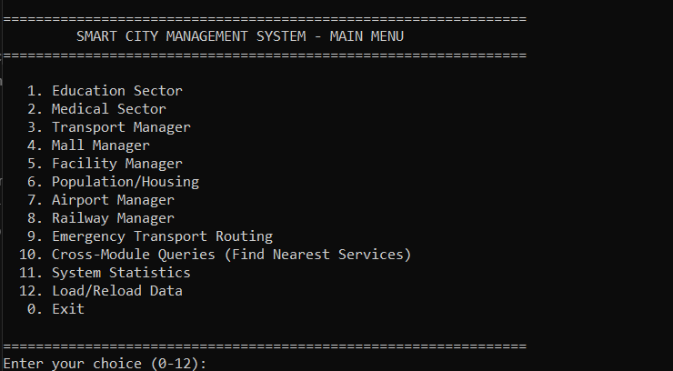
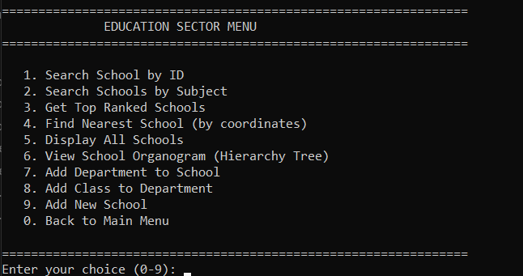
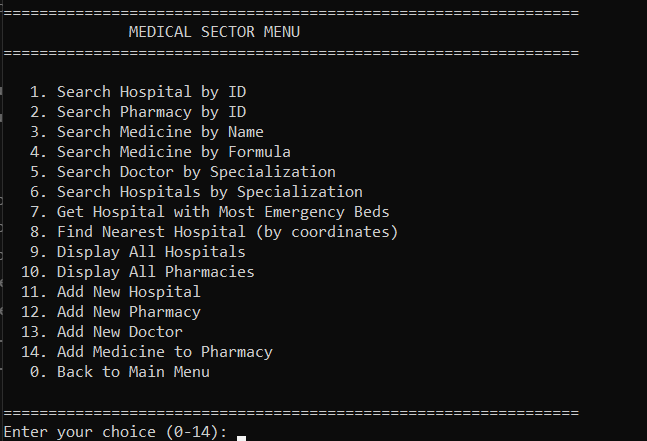
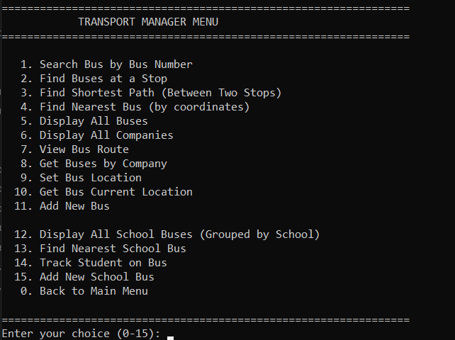
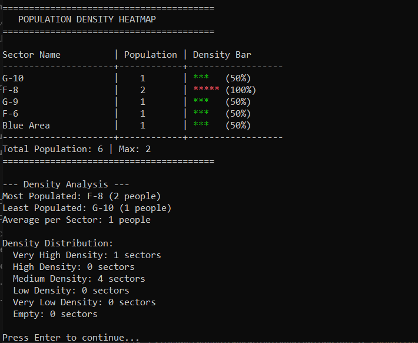
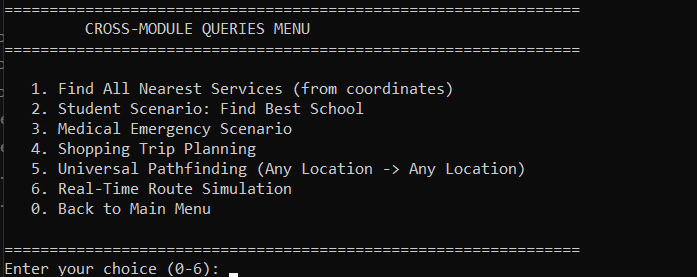
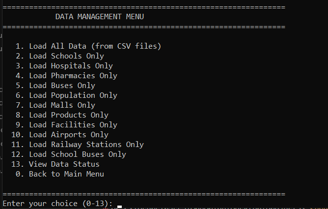

# 🏙️ Smart City Management System

<div align="center">

**A comprehensive C++ application for managing urban services and infrastructure in Islamabad**

[](https://isocpp.org/)
[](https://www.microsoft.com/windows)

*A complete solution for managing education, healthcare, transportation, commerce, and population data using advanced data structures and algorithms.*

</div>

---

## 📋 Table of Contents

- [Overview](#-overview)
- [Features](#-features)
- [Screenshots](#-screenshots)
- [Technical Architecture](#-technical-architecture)
- [Data Structures](#-data-structures)
- [Installation](#-installation)
- [Usage Guide](#-usage-guide)
- [Project Structure](#-project-structure)
- [CSV Data Format](#-csv-data-format)
- [Key Algorithms](#-key-algorithms)
- [Future Enhancements](#-future-enhancements)
- [Contributing](#-contributing)
- [How to Run](#-how-to-run)

---

## 🎯 Overview

The **Smart City Management System** is a robust C++ console application designed to manage and coordinate various urban services in Islamabad. This system provides comprehensive tools for administrators to handle education, medical facilities, transportation networks, commercial establishments, public facilities, and population data through an intuitive command-line interface.

### Key Highlights

✨ **8 Major Modules** - Education, Medical, Transport, Malls, Facilities, Population, Airports, Railways  
🚀 **High Performance** - Optimized algorithms with O(1) lookups and efficient graph traversals  
📊 **Data-Driven** - CSV-based data loading with flexible import/export capabilities  
🔍 **Advanced Search** - Multi-criteria search and nearest neighbor algorithms  
🌐 **Graph-Based Routing** - Shortest path calculations and location-based queries  
📈 **Analytics** - Population reports, statistics, and heatmap visualizations  

---

## ✨ Features

### 🎓 Education Sector
- **School Management**: Register and manage schools with ratings and subject offerings
- **Search Operations**: Find schools by ID, subject, or location
- **Ranking System**: Get top-ranked schools using priority queue (MinHeap)
- **Hierarchical Structure**: Tree-based organization of schools → departments → classes
- **Organogram Visualization**: Display school organizational charts

### 🏥 Medical Sector
- **Hospital Management**: Track hospitals with emergency bed capacity and specializations
- **Pharmacy Network**: Manage pharmacies and medicine inventories
- **Doctor Directory**: Search doctors by specialization
- **Emergency Services**: Find hospitals with most emergency beds (priority queue)
- **Medicine Search**: Search medicines by name or chemical formula

### 🚌 Transport Manager
- **Bus Network**: Manage public buses with routes and companies
- **Real-Time Tracking**: Track bus locations and current stops
- **Route Planning**: Calculate shortest paths between stops (Dijkstra's algorithm)
- **School Buses**: Dedicated school bus management system
- **Student Tracking**: Track students on specific school buses

### 🛍️ Mall Manager
- **Mall Directory**: Manage shopping malls and their locations
- **Product Catalog**: Search products across all malls
- **Category Filtering**: Filter products by category
- **Location Services**: Find nearest malls by coordinates or stop ID

### 🏛️ Facility Manager
- **Public Facilities**: Manage parks, mosques, water coolers, etc.
- **Type-Based Search**: Filter facilities by type (Park, Mosque, etc.)
- **Geographic Queries**: Find nearest facilities using graph algorithms

### 👥 Population/Housing
- **Citizen Database**: Comprehensive citizen records with CNIC tracking
- **Housing Hierarchy**: Sector → Street → House → Family structure (Tree)
- **Demographic Reports**:
  - Age distribution analysis
  - Gender ratio statistics
  - Occupation breakdown
  - Population density reports
- **Heatmap Generation**: Visual population distribution maps

### ✈️ Airport Manager
- **Airport Directory**: Manage airports with IATA codes
- **Distance Calculation**: Calculate air distances between airports (Haversine formula)
- **Location Search**: Find nearest airports by coordinates

### 🚂 Railway Manager
- **Station Network**: Manage railway stations with codes
- **Route Planning**: Calculate distances between stations
- **Location Services**: Find nearest stations

### 🚨 Emergency Transport Routing
- **Emergency Dispatch**: Route emergency vehicles efficiently
- **Shortest Path**: Real-time shortest path calculation
- **Hospital Integration**: Coordinate with medical facilities

### 🔗 Cross-Module Queries
- **Multi-Service Search**: Find all nearest services from coordinates
- **Scenario Planning**:
  - Student scenario: Find best school
  - Medical emergency: Nearest hospital
  - Shopping trips: Route planning
- **Universal Pathfinding**: Any location to any location routing

### 📊 System Statistics
- **Module Statistics**: Counts and summaries for each module
- **Graph Analytics**: Shared graph statistics
- **Data Structure Usage**: Performance metrics

---

## 📸 Screenshots

### Main Menu
<div align="center">
  

*Main Menu - Central hub for all system modules*

</div>

### Education Sector
<div align="center">
  
<br>
*Education Sector - School management and search*

</div>

### Medical Sector
<div align="center">
  

*Medical Sector - Hospital and pharmacy management*

</div>

### Transport Manager
<div align="center">
  

*Transport Manager - Bus network and routing*

</div>

### Population Reports
<div align="center">
  

*Population Analytics - Demographic reports and heatmaps*

</div>

### Cross-Module Queries
<div align="center">
  

*Cross-Module Queries - Find nearest services and integrated queries*

</div>

### System Statistics
<div align="center">
  

*System Statistics - Module counts and performance metrics*

</div>

### Data Management
<div align="center">
  

*Data Management - CSV data loading and status*

</div>

---

## 🏗️ Technical Architecture

### System Design

```
┌─────────────────────────────────────────────────────────────┐
│                   Menu System (CLI)                          │
│                    menu_system.cpp                           │
└──────────────────────┬──────────────────────────────────────┘
                       │
       ┌───────────────┴───────────────┐
       │                               │
┌──────▼──────────┐          ┌────────▼─────────┐
│  Data Loader    │          │  Shared Graph    │
│  DataLoader     │◄─────────┤  Graph (200)     │
│  (CSV Parser)   │          │  (City Network)  │
└─────────────────┘          └──────────────────┘
       │                               │
       └───────────────┬───────────────┘
                       │
    ┌──────────────────┼──────────────────┐
    │                  │                  │
┌───▼────┐    ┌────────▼─────┐    ┌──────▼──────┐
│Education│    │   Medical    │    │  Transport  │
│ Sector  │    │   Sector     │    │  Manager    │
└─────────┘    └──────────────┘    └─────────────┘
    │                  │                  │
┌───▼────┐    ┌────────▼─────┐    ┌──────▼──────┐
│  Mall  │    │  Population  │    │  Facilities │
│Manager │    │   Manager    │    │  Manager    │
└────────┘    └──────────────┘    └─────────────┘
    │                  │                  │
┌───▼────┐    ┌────────▼─────┐
│Airport │    │   Railway    │
│Manager │    │   Manager    │
└────────┘    └──────────────┘
```

### Core Components

- **Menu System**: Central CLI interface managing user interactions
- **Data Loader**: CSV parsing and data import system
- **Shared Graph**: Common graph structure for location-based queries
- **Manager Classes**: Specialized managers for each urban service
- **Custom Data Structures**: High-performance collections and algorithms

---

## 📚 Data Structures

This project demonstrates mastery of fundamental data structures and algorithms:

| Data Structure | Usage | Time Complexity |
|----------------|-------|-----------------|
| **HashTable** | School/Hospital/Bus lookup by ID | O(1) average |
| **Graph** | Location network, shortest paths | O(V + E) |
| **MinHeap** | School rankings, emergency beds | O(log n) insert |
| **Tree** | School hierarchy, population structure | O(n) traversal |
| **SinglyLinkedList** | Dynamic data storage | O(n) search |
| **CircularQueue** | Bus route management | O(1) enqueue/dequeue |
| **Stack** | Algorithm implementations | O(1) push/pop |

### Implementation Highlights

- **HashTable**: Separate chaining with prime number sizing for collision handling
- **Graph**: Adjacency list representation with Dijkstra's shortest path
- **Tree**: N-ary tree for hierarchical data (Schools → Departments → Classes)
- **MinHeap**: Array-based heap for priority queue operations

---

## 🔧 Installation

### Prerequisites

- **Windows 10/11** (x64)
- **Visual Studio 2019 or later** (with C++ Desktop Development workload)
- All source files (`.h` and `.cpp` files)
- CSV dataset files (`SmartCity_dataset/` folder)

### Build Instructions

1. **Create a New Visual Studio Project**
   - Open Visual Studio
   - Create a new **Console Application (C++)** project
   - Choose any project name you prefer

2. **Add Header Files (.h)**
   - Add all header files to your project:
     - Right-click project → Add → Existing Item
     - Select all `.h` files
     - Maintain the `core_classes/` folder structure if present

3. **Add Source Files (.cpp)**
   - Add all source files to your project:
     - Right-click project → Add → Existing Item
     - Select all `.cpp` files
     - Ensure `menu_system.cpp` is included (contains `main()` function)

4. **Add Dataset Folder**
   - Copy the `SmartCity_dataset/` folder to your project directory
   - Place it at the same level as your `.vcxproj` file
   - The application will load CSV files from this directory

5. **Build and Run**
   - Select `Debug x64` or `Release x64` configuration
   - Build the solution (Ctrl+Shift+B)
   - Run the application (F5)

---

## 🚀 How to Run

### Step-by-Step Execution Guide

1. **Build the Project**
   ```bash
   # In Visual Studio:
   # Press Ctrl+Shift+B or go to Build → Build Solution
   ```

2. **Locate the Executable**
   - After successful build, find the `.exe` file in:
     - **Debug**: `x64/Debug/YourProjectName.exe`
     - **Release**: `x64/Release/YourProjectName.exe`

3. **Run from Visual Studio**
   - Press **F5** to run with debugging
   - Press **Ctrl+F5** to run without debugging
   - Or go to: **Debug → Start Without Debugging**

4. **Run from Command Line**
   ```bash
   # Navigate to the executable directory
   cd x64\Debug
   
   # Run the executable
   .\YourProjectName.exe
   ```

5. **Load Data First**
   - When the application starts, you'll see the main menu
   - Select option **12: Load/Reload Data**
   - Choose option **1: Load All Data** to import all CSV files
   - Wait for confirmation messages

6. **Use the System**
   - Navigate through menus using number keys
   - Enter **0** to go back to previous menu
   - Enter **0** in main menu to exit

### Quick Start Example

```
1. Run the executable
2. Main Menu appears → Select "12" (Load Data)
3. Select "1" (Load All Data)
4. Wait for: "[OK] Loaded X schools", etc.
5. Select "0" to go back to Main Menu
6. Now you can:
   - Select "1" for Education → Search schools
   - Select "2" for Medical → Search hospitals
   - Select "3" for Transport → Find bus routes
   - etc.
```

### Troubleshooting

**Problem**: CSV files not found
- **Solution**: Ensure `SmartCity_dataset/` folder is in the same directory as your `.vcxproj` file

**Problem**: Build errors
- **Solution**: Make sure all `.h` and `.cpp` files are added to the project

**Problem**: Application crashes on startup
- **Solution**: Check that `menu_system.cpp` is set as the startup file (contains `main()`)

**Problem**: "Cannot open include file" errors
- **Solution**: Ensure `core_classes/` folder structure is maintained in your project

### Project Structure
```
YourProject/
├── Source Files/               # All .cpp and .h files
│   ├── menu_system.cpp        # CLI interface (main entry point)
│   ├── EducationSector.h/cpp   # Education module
│   ├── MedicalSector.h/cpp     # Medical module
│   ├── TransportManager.h/cpp  # Transport module
│   ├── MallManager.h/cpp       # Mall module
│   ├── FacilityManager.h/cpp   # Facilities module
│   ├── PopulationHousing.h/cpp # Population module
│   ├── AirportManager.h/cpp     # Airport module
│   ├── RailwayManager.h/cpp     # Railway module
│   ├── EmergencyManager.h/cpp   # Emergency routing
│   └── core_classes/            # Custom data structures
│       ├── HashTable.h/cpp
│       ├── Graph.h/cpp
│       ├── Tree.h/cpp
│       ├── MinHeap.h/cpp
│       ├── Stack.h/cpp
│       ├── SinglyLinkedList.h/cpp
│       ├── CircularQueue.h/cpp
│       └── DataLoader.h/cpp
├── SmartCity_dataset/          # CSV data files
│   ├── schools.csv
│   ├── hospitals.csv
│   ├── buses.csv
│   ├── pharmacies.csv
│   ├── malls.csv
│   ├── facilities.csv
│   ├── airports.csv
│   ├── railways.csv
│   ├── population.csv
│   ├── products.csv
│   ├── school_buses.csv
│   ├── companies.csv
│   └── stops.csv
└── README.md                   # This file
```

---

## 📖 Usage Guide

### Starting the System

1. Build and run your project (F5 in Visual Studio)
2. The system initializes and displays the main menu
3. Navigate using numbered options (0-12)

### Loading Data

1. Select **Option 12: Load/Reload Data**
2. Choose from:
   - **Option 1**: Load all data at once
   - **Options 2-12**: Load specific data types
   - **Option 13**: View current data status

### Common Operations

#### Search for a School
```
Main Menu → 1 (Education) → 1 (Search School by ID) → Enter "S01"
```

#### Find Nearest Hospital
```
Main Menu → 2 (Medical) → 8 (Find Nearest Hospital) → Enter coordinates
```

#### Calculate Shortest Bus Route
```
Main Menu → 3 (Transport) → 3 (Shortest Path) → Enter start & end stops
```

#### View Population Statistics
```
Main Menu → 6 (Population) → 8-12 (Various Reports)
```

#### Cross-Module Query
```
Main Menu → 10 (Cross-Module) → 1 (Find All Nearest Services) → Enter coordinates
```

---

## 📁 CSV Data Format

### Schools (`schools.csv`)
```csv
SchoolID,Name,Sector,Rating,Subjects
S01,City School,G-10,4.5,"Math, Physics, English"
S02,Allied School,F-8,4.0,"CS, Math, Urdu"
```

### Hospitals (`hospitals.csv`)
```csv
HospitalID,Name,Sector,EmergencyBeds,Specialization
H01,PIMS,G-8,12,"General, Cardiology"
H02,Shifa International,H-8,20,"Oncology, Surgery"
```

### Buses (`buses.csv`)
```csv
BusNo,Company,CurrentStop,Route
B101,MetroBus,Stop3,"Stop1 > Stop2 > Stop3 > Stop4"
B102,CapitalTrans,Stop1,"Stop1 > Stop5 > Stop8"
```

### Population (`population.csv`)
```csv
CNIC,Name,Gender,Age,Sector,Street,HouseNo,Occupation
61101-1111111-1,Ahmed Khan,Male,45,G-10,22,180,Engineer
```

> **Full CSV schemas**: See `SmartCity_dataset/` directory for all data formats

---

## 🔬 Key Algorithms

### Shortest Path (Dijkstra's Algorithm)
- **Implementation**: `Graph::dijkstra()`
- **Use Case**: Finding shortest routes between bus stops
- **Complexity**: O(V²) with adjacency matrix, O(E log V) optimized

### Haversine Formula
- **Implementation**: `AirportManager::calculateDistance()`
- **Use Case**: Calculating air distances between airports
- **Accuracy**: Spherical Earth model

### Tree Traversal
- **Implementation**: `Tree::displayTree()`
- **Use Case**: Displaying school hierarchies and population structures
- **Methods**: Pre-order, in-order, post-order traversals

### Priority Queue (MinHeap)
- **Implementation**: `MinHeap::extractMin()`
- **Use Case**: School rankings, hospital bed availability
- **Operations**: Insert O(log n), ExtractMin O(log n)

---

## 🚀 Future Enhancements

- Web Interface & Mobile App
- Database Integration
- Real-Time Updates

---

## 🤝 Contributing

Contributions are welcome! Please follow these steps:

1. **Fork the repository**
2. **Create a feature branch** (`git checkout -b feature/AmazingFeature`)
3. **Commit your changes** (`git commit -m 'Add some AmazingFeature'`)
4. **Push to the branch** (`git push origin feature/AmazingFeature`)
5. **Open a Pull Request**

### Contribution Guidelines
- Follow C++ style guidelines (Google C++ Style Guide)
- Add comments for complex algorithms
- Include test cases for new features
- Update documentation as needed

---

## 📊 Project Statistics

- **Lines of Code**: ~15,000+
- **Modules**: 8 major sectors
- **Data Structures**: 7 custom implementations
- **Algorithms**: 10+ key algorithms
- **CSV Files**: 12 data files
- **Features**: 100+ operations
